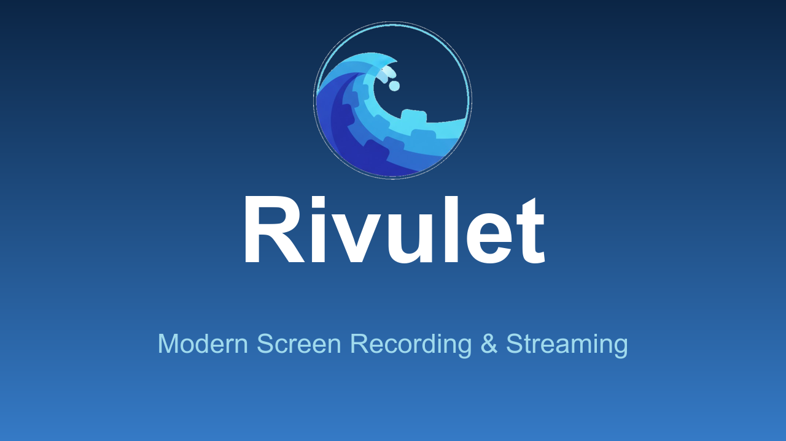

<div align="center">

# 🌊 Rivulet

**Modern Screen Recording & Streaming Software**

[](https://github.com/thoser666/rivulet/actions)
[](LICENSE)
[](https://www.rust-lang.org)
[](https://github.com/thoser666/rivulet)
[](https://github.com/thoser666/rivulet)

*A Rust recording and streaming engine — built for performance, safety, reliability, and embeddability*

[Features](#-features) • [Installation](#-installation) • [Roadmap](#-roadmap) • [Contributing](#-contributing)



</div>

---

## 🎯 Vision

Rivulet is **not an OBS clone**. It is an **embeddable, deterministic recording & streaming engine written in Rust**, with a modern GUI on top. It provides the OBS core feature set (capture, encoding, audio, streaming, dual output) while turning OBS's architectural gaps into its own strengths: automation instead of interactivity, a library instead of a monolith, a modern render path instead of legacy OpenGL/D3D, and a stable plugin ABI instead of version-sensitive C DLLs.

### Why Rust?
- 🔒 **Memory Safety** - No segfaults, no data races
- ⚡ **Performance** - Zero-cost abstractions
- 🛡️ **Reliability** - Catch bugs at compile time
- 🌍 **Cross-Platform** - Write once, run everywhere

### 🧭 Positioning: OBS weaknesses as Rivulet strengths

| OBS strength | OBS weakness | Rivulet's answer |
| --- | --- | --- |
| Powerful, mature feature set | Interactive-first: no headless/CI/render-farm use, hard to automate | Deterministic pipeline, headless CLI, testable engine (M6) |
| Monolithic app + libobs | `libobs` is not a clean library API; embedding it into products is painful | `rivulet-core` as a normal, semver-stable crate (M7) |
| Plugin ecosystem | C/C++ plugins against the libobs ABI, version-sensitive, can crash the app | WASM plugin runtime + temporary OBS compat mode (M5) |
| Powerful renderer | OpenGL/D3D legacy, hard to modernize | WebGPU/Zero-copy from the ground up (M8) |
| Streaming foundation | Core is RTMP/FLV, low-latency protocols are fiddly | WebRTC/WHIP & SRT/RIST as first-class citizens (M3) |
| Windows-first | Uneven platform parity (macOS/Linux weaker) | Parity as a release blocker, not an afterthought (M5) |

### Long-term Goals (v1.0+)
- **Feature Parity** with OBS Studio (core feature set)
- **Temporary OBS plugin compatibility** as a bridge, long-term **WASM plugin ecosystem**
- **Modern Architecture** - Clean, maintainable codebase
- **Deterministic & Embeddable** - Engine as a library, headless-capable, CI-friendly
- **Active Community** - Open development, regular updates
- **Internationalization** - UI and docs are language-neutral; locale files drive all visible strings

---

## ✨ Features

### ✅ Currently Available (v0.2/v0.3)

- **Screen Capture** - Capture your primary monitor in real-time
- **Window Capture** - Capture a single application window (games, etc.) in addition to full monitors, with a window picker in the GUI (Linux & Windows)
- **Screen + Audio Recording (Linux GUI)** - Full recording flow in the GUI: monitor selection, start/stop, recording timer; system audio + microphone are captured and mixed into the MP4
- **Video Encoding** - H.264 encoding via GStreamer (`x264enc`, low-latency tuning) or hardware-accelerated encoders
- **Hardware Encoding** - NVIDIA NVENC (`nvh264enc`), Intel QuickSync (`qsvh264enc`) and AMD AMF (`amfh264enc`) with automatic detection of the best available encoder and fallback to software x264; engine API `set_video_encoder(VideoEncoder)` / `set_video_bitrate(kbps)`
- **Audio Capture (engine, Linux)** - Desktop sound and microphone, mixed in real time via GStreamer (48 kHz stereo, per-source volume); usable via the `rivulet-audio` crate and the `record_screen_audio` example
- **Audio Mixer UI (Linux GUI)** - Start/stop audio capture with live level meter (dB), per-source volume sliders for system/mic
- **Separate Audio Tracks** - System and microphone output as separate tracks in the MP4 (via the "Separate Tracks" option, Linux GUI); engine API `push_audio_track(frame, AudioTrack)`
- **RTMPS Streaming** - Live to Twitch, Kick, YouTube or any custom RTMP/RTMPS ingest (H.264+AAC over FLV); `StreamSettings` presets, engine APIs `set_stream_settings` + `start_streaming` (pure stream) or `start_local_recording` (dual output); example `stream_rtmps`
- **Dual Output** - Record locally and stream simultaneously; once encoded, split via `tee` into the MP4 file and the FLV/RTMPS sink (enabled by configuring both a local recording and stream settings)
- **Stream Health & Network Stats** - Live status (`Connecting`/`Good`/`Warning`/`Poor`) with sent/dropped frame counters, bitrate (kbps) and FPS over a sliding window; derived from drop ratio (>5% Poor, >1% Warning), throughput collapse and stalls; engine API `stream_stats()`, polled in `stream_rtmps`
- **Recording Performance Metrics** - Live FPS, encoder load (%) and output file size during a recording, measured via GStreamer pad probes (per-frame encode duration paired by PTS, filesink byte counter); engine API `recording_stats()`, shown in the GUI next to the recording timer
- **Auto-Update** - Checks the GitHub Releases API on startup and manually for newer versions, downloads the matching platform package (MSI / AppImage / DMG) and launches the installer; the alpha channel keeps up with every feature push
- **Live Preview** - See what you're recording as you record
- **Tab-Based Interface** - Clean, DaVinci Resolve-style UI
  - Record Tab - Main recording controls and preview
  - Settings Tab - All configuration options
  - About Tab - Project information
- **Customizable Settings**
  - Adjustable FPS (15-60)
  - Bitrate control (1-50 Mbps)
  - Custom output path with file picker
  - Auto-timestamped filenames
- **Cross-Platform** - Windows, macOS, and Linux support (via xcap)
- **Modern UI** - Clean interface built with egui
- **Internationalized UI** - All visible strings are driven by locale files (English by default, German included)

### 🚧 In Development (v0.4+)

See [Roadmap](#-roadmap) for detailed timeline.

---

## 🚀 Roadmap

> **Goal:** OBS core parity *and* the architectural strengths OBS cannot offer (determinism, embeddability, modernity).
> **Strategy:** First a stable, embeddable engine, then scenes & streaming, then the differentiation features (M6–M9) as product identity.

### Milestone overview

| Milestone | Focus | Status |
| --- | --- | --- |
| M0 – Recording Foundation | Capture, Encoding, Audio, GUI | ✅ Done |
| M1 – Solid Recording | Audio tracks, Hardware encoding, QoL | 🚧 In progress |
| M2 – Scenes & Composition | OBS core: scenes, sources, transitions | 📅 Planned |
| M3 – Streaming | RTMP/RTMPS, Dual output, WebRTC/SRT | 🚧 In progress |
| M4 – Advanced Output | Virtual camera, Replay buffer, Filters | 📅 Planned |
| M5 – Ecosystem & Parity | WASM plugins, OBS compat, platform parity | 📅 Planned |
| M6 – Automation & Determinism | Headless, CI rendering, reproducible pipelines | 📅 Planned |
| M7 – Embeddable Engine | Stable `rivulet-core` API, docs, tooling | 📅 Planned |
| M8 – Modern Architecture | WebGPU renderer, zero-copy, lightweight | 📅 Planned |
| M9 – AI Chat Assistant | Local-first LLM chat bot for streamers | 📅 Planned |

---

### ✅ M0 – Recording Foundation

**Status: Done**

- [x] Screen capture (monitor, real-time)
- [x] H.264 video encoding (FFmpeg/GStreamer)
- [x] Audio capture (system + microphone, mixed, 48 kHz stereo)
- [x] Audio/video synchronization
- [x] Audio mixer UI with live level meter and volume sliders
- [x] GUI recording with monitor selection and recording timer (Linux)
- [x] Skeleton: engine, recorder, scene/source models, plugin system (stubs)

---

### 🚧 M1 – Solid Recording

**Status: In progress**

**Audio**
- [x] Separate audio tracks (system/mic)
- [ ] Audio filters (noise suppression, compressor, limiter)
- [ ] Audio monitoring (source preview)

**Performance**
- [x] Hardware encoding (NVIDIA NVENC, Intel QuickSync, AMD AMF)
- [x] Automatic detection of the best encoder with fallback
- [x] Performance metrics (FPS, encode load, file size)

**Updates**
- [x] Auto-update (update check, download & install via GitHub Releases)
- [x] Code signing (signing automation present, secrets needed)

**Quality of Life**
- [ ] Hotkeys (record, pause, mute)
- [ ] Recording timer overlay and FPS counter
- [ ] Region capture and multi-monitor selection
- [ ] Codec selection UI (H264/H265/VP9)
- [ ] Preset management (1080p60, 720p30, ...)

**Goal:** High-quality recording with audio as a solid foundation for scenes & streaming.

---

### 🎨 M2 – Scenes & Composition

**Status: Planned**

The core concept of OBS: scenes, sources, and transitions.

- [ ] Scene management (multiple scenes, switching)
- [x] Sources — window capture (monitor + individual windows, Linux & Windows)
- [ ] Sources (image, text, webcam, mute)
- [ ] Source composition (layers, position, scaling, cropping)
- [ ] Transitions (fade, cut, stinger)
- [ ] Overlays (picture-in-picture, banners)
- [ ] Chroma key / green screen
- [ ] Studio mode (preview/program)

**Goal:** The composable workspace OBS users expect.

---

### 📡 M3 – Streaming

**Status: In progress**

- [x] RTMP/RTMPS client implementation (H.264+AAC, FLV muxing)
- [x] TLS-encrypted streaming (RTMPS) with certificate validation
- [x] Dual output (stream + recording in parallel; encoded once, split via `tee`)
- [x] Stream health and network stats (status via drop ratio/throughput, `stream_stats()` API)
- [ ] Adaptive bitrate
- [x] Platform integrations (Twitch, Kick, YouTube via RTMPS; custom)
- [ ] Stream key management and stream presets
- [x] Custom RTMP server support (arbitrary `rtmp://`/`rtmps://` URLs)
- [ ] **WebRTC/WHIP** as a first-class protocol (ultra-low-latency, SFU-compatible)
- [ ] **SRT/RIST** for professional contribution/relay

**Goal:** Live streaming to the common platforms *and* low-latency protocols as native citizens instead of RTMP legacy.

---

### 🎥 M4 – Advanced Output & Capture

**Status: Planned**

- [ ] Virtual camera output
- [ ] Replay buffer / instant replay
- [ ] Browser sources (CEF integration)
- [ ] Multi-track audio export
- [ ] Video filters & effects
- [ ] Cloud integration (cloud recordings)

**Goal:** The advanced output and production features of OBS.

---

### 🔌 M5 – Ecosystem & Platform Parity

**Status: Planned**

- [ ] Plugin system (native Rust plugins)
- [ ] **WASM plugin runtime** (stable ABI, sandboxed: plugins can never crash the app; long-term target plugin model)
- [ ] **OBS plugin compatibility layer** — *temporary bridge*: opt-in "Compatibility Mode" (explicitly marked as unsafe), loads native libobs plugins (encoders/filters/sources without UI); UI plugins (Qt) are out of scope; the goal is migration to the WASM plugin system
- [ ] Mobile companion app (remote control)
- [ ] **Windows/macOS feature parity** (currently Linux-first; window capture on Windows exists, macOS still open) — as a release blocker, not an afterthought
- [x] Installers (Windows MSI, macOS DMG, Linux AppImage) — automated in CI
- [x] Code signing (signing automation present, secrets needed)
- [ ] Telemetry (opt-in, privacy-friendly)
- [ ] Multi-language support (locale files fully wired)

**Goal:** OBS core parity across all platforms, with a plugin model structurally superior to OBS (WASM instead of a C ABI), plus OBS compat as a transition bridge.

---

### 🤖 M6 – Automation & Determinism ("Render-First")

**Status: Planned**

*Differentiation pillar #1: OBS is interactive-first, Rivulet is deterministic.*

- [ ] Deterministic pipeline (controllable engine clock, reproducible output from the same inputs)
- [ ] Headless CLI: capture/rendering without a GUI (`rivulet record ...`), usable as binary and library
- [ ] CI-friendly rendering: generate video from code (Remotion approach, native in Rust) — e.g. batch creation, tests, per-frame screenshots
- [ ] Pipeline inspector/diagnostics tooling (analogous to `gst-inspect`, `gst-launch`), embedded in the engine
- [ ] Deterministic tests as first-class citizens (golden-frame tests, exact PTS/DTS verification)

**Goal:** "Video from code" and reproducible capture pipelines — the reason a developer/team *cannot* use OBS but can use Rivulet.

---

### 📦 M7 – Embeddable Engine & API

**Status: Planned**

*Differentiation pillar #2: `rivulet-core` is a normal library, not a monolith with retrofitted API.*

- [ ] Stabilized public API for `rivulet-core` (semver 1.0, `#![warn(missing_docs)]`, crate-style types)
- [ ] Comprehensive API docs + examples (recording, streaming, dual output, encoder selection, frame streaming)
- [ ] In-process capture API: embed a recording feature in any Rust app (audio/video capture, encoding, file/stream)
- [ ] Feature detection and runtime diagnostics as an API (`detect_available_encoders()`, encoder fallback)
- [ ] Abstraction of capture backends (xcap, PipeWire, Metal/WGC) behind stable traits

**Goal:** "Recording you can embed into your product" — the use case OBS is architecturally not built for.

---

### ⚡ M8 – Modern Architecture

**Status: Planned**

*Differentiation pillar #3: a modern render path from the ground up instead of OpenGL/D3D legacy.*

- [ ] WebGPU renderer (wgpu) for preview, compositing, and effects
- [ ] Compute-based video/audio filters (chroma key, scaling, filters) instead of CPU/shader legacy
- [ ] Zero-copy/GPU-direct capture paths (DMA-BUF, WGC/NVENC-direct, Metal IO)
- [ ] Performance and footprint metrics (idle CPU/RAM, laptop battery) as CI checks
- [ ] Modern UI foundation (egui) consistent across all platforms

**Goal:** Lightweight and future-proof — technically ahead where OBS has to retrofit.

---

### 🤖 M9 – AI Chat Assistant

**Status: Planned**

*Differentiation pillar #4: OBS has no native chat; streamers use cloud SaaS. Rivulet ships a local-first AI chat assistant.*

- [ ] Chat adapters: Twitch (IRC/WebSocket), Kick (WebSocket), YouTube (Live API)
- [ ] LLM provider abstraction — **local-first**:
  - Ollama (`http://localhost:11434`) as default
  - llama.cpp server / in-process (`llama_cpp2`)
  - OpenAI-compatible endpoints (cloud, optional)
- [ ] Personas: configurable system prompts per "personality" (TOML)
- [ ] Custom commands (`!so`, `!song`, `!setup`, ...) — deterministic, no LLM needed
- [ ] Context/memory: short chat history + streamer info
- [ ] Moderation: toxicity filter as a pre-check before responding
- [ ] Bot coexistence: detect other active bots in the same channel (e.g. the
      [Vivid](https://github.com/thoser666/Vivid) Android bot) and suppress
      double replies — shared reply cooldown, command-claiming, optional
      silent/observer mode
- [ ] GUI panel (chat + bot settings) wired through the i18n layer

**Goal:** A private, subscription-free, API-free AI chat assistant that runs fully locally — the counter-position to cloud chat bots like StreamChatAI.

> ⚠️ **Coexistence with Vivid:** Rivulet (desktop) and Vivid (Android) can be used at the same time — e.g. Vivid streaming from the phone while Rivulet runs on the PC. The Rivulet bot must therefore never fight with the Vivid bot for the same chat: no duplicate replies, coordinated `!`-commands, and a per-channel configurable bot identity.

---

### 🎯 Feature-Parity Checklist (vs. OBS)

| OBS category | Status |
| --- | --- |
| Capture sources (display, window, webcam) | Partial (display + window) |
| Scenes & transitions | Open |
| Audio mixer (sources, tracks, filters) | Partial (mixer, separate tracks) |
| Recording & encoding | Partial (H.264 hardware + software) |
| Streaming (RTMP, platforms) | Partial (RTMPS Twitch/Kick/YouTube) |
| Virtual camera | Open |
| Replay buffer | Open |
| Browser sources | Open |
| Studio mode & hotkeys | Open |
| Plugin ecosystem & OBS compatibility | Open |
| Multi-track audio | Partial (2 tracks) |
| Platform parity (Windows/macOS) | Open |
| AI chat assistant | Open (M9) |

---

## 📺 Streaming Example

The `stream_rtmps` example (`rivulet-audio`) captures the screen together with
mixed system/microphone audio and streams live via RTMPS to Twitch, Kick,
YouTube, or any RTMP server:

```bash
cd rivulet-audio

# Twitch (default) or YouTube
RIVULET_STREAM_KEY="your-stream-key" \
RIVULET_STREAM_SECS=60 \
cargo run --example stream_rtmps

# Kick requires the IVS ingest endpoint
RIVULET_STREAM_URL="rtmps://<id>.global-contribute.live-video.net/app" \
RIVULET_STREAM_PLATFORM=kick \
RIVULET_STREAM_KEY="your-stream-key" \
cargo run --example stream_rtmps

# Any RTMP/RTMPS server (e.g. local)
RIVULET_STREAM_URL="rtmp://127.0.0.1:1935/live" \
RIVULET_STREAM_PLATFORM=custom \
RIVULET_STREAM_KEY="test" \
cargo run --example stream_rtmps
```

**Environment variables:**

| Variable | Meaning | Required |
| --- | --- | --- |
| `RIVULET_STREAM_KEY` | Stream key from the platform dashboard | Yes |
| `RIVULET_STREAM_PLATFORM` | `twitch` (default) · `kick` · `youtube` · `custom` | No |
| `RIVULET_STREAM_URL` | Ingest URL (for `custom` and `kick`) | depends on platform |
| `RIVULET_STREAM_SECS` | Stream duration in seconds (default: 10) | No |
| `RIVULET_STREAM_RECORD_PATH` | Optional MP4 path for parallel recording (dual output) | No |

Every two seconds the example prints the live health status, e.g.
`[health] Good | 2500 kbps | 30.0 fps | 120 sent / 0 dropped`.

---

## 🛠 Development

### Tests

Run the full test suite:

```bash
# Build tests and run them
cargo test --workspace

# Run tests for a single crate
cargo test -p rivulet-core
```

The tests cover the pure data structures (`AudioFrame`, `OutputSettings`, `RecordingSettings`, ...), the engine's recording pipeline (synthetic video + audio to MP4, including separate audio tracks verified via the GStreamer Discoverer), the streaming pipelines (RTMPS/dual output parse and route audio correctly), stream health tracking (status derivation from drop ratio, bitrate/FPS collapse and stalls), the encoder/recorder lifecycle, the video encoder abstraction (element names, detection order, fallback, pipeline fragments, 4:2:0 input caps), the recording performance metrics (FPS estimation, encoder load from a sliding window, file byte accounting, reset semantics), the updater (GitHub release parsing, version comparison, platform asset selection, HTTP fetch against a local test server) and the i18n layer (locale resolution and translation lookups), plus the release code-signing automation (`rivulet-core/tests/ci_signing.rs` — verifies the signing scripts exist, that signing is gated on secret-presence outputs rather than raw secrets in `if:` conditions, and that the Windows MSI is signed after it is built). Building and running the tests requires GStreamer (dev packages + plugins) and, on Linux, the `LIBCLANG_PATH` environment variable. The hardware-encoding end-to-end test only runs when the matching GPU plugin is present.

### Linting & Formatting

```bash
# Check formatting
cargo fmt --all -- --check

# Lint the whole workspace (including tests and examples)
cargo clippy --workspace --all-targets -- -D warnings
```

The CI also runs [actionlint](https://github.com/rhysd/actionlint) to lint the
GitHub Actions workflow files and [ShellCheck](https://www.shellcheck.net/) on
the macOS packaging scripts.

### Assets

The README thumbnail (`docs/thumbnail.png`) and the Linux AppImage icon
(`packaging/rivulet.png`) are generated from the logo by
`scripts/generate-assets.sh` (requires ImageMagick). Re-running the script
reproduces the committed files byte-for-byte, so any branding change is a single
command:

```bash
scripts/generate-assets.sh
```

> **Note:** On Linux, set `LIBCLANG_PATH` to your LLVM `lib` directory (e.g. `export LIBCLANG_PATH=/usr/lib/llvm-14/lib`) if the `clang-sys` build fails.

---

## 📦 Installation

### Prerequisites

**GStreamer** (Core + `gst-plugins-good`/`gst-plugins-bad`/`gst-plugins-ugly` + `gst-libav`) is required by the engine for encoding, audio mixing, and streaming (H.264 + AAC).

**FFmpeg** is only used by the legacy encoder in `rivulet-streaming` and must be available when that path is used:

#### Windows
```powershell
# Using Chocolatey
choco install ffmpeg

# Or download from: https://ffmpeg.org/download.html
```

---

## 📦 Releases

Releases are fully automated via GitHub Actions:

### Alpha channel (`release.yml`)

Every push with a `feat:` commit (Conventional Commits) to `develop` produces
a new alpha release:

1. **Versioning**: The next version is computed via SemVer from the commits
   since the last tag (`scripts/release-version.sh`), plus `-alpha.N`
   (N = next free number). `Cargo.toml` and `CHANGELOG.md` are bumped and
   committed as `chore(release): prepare vX.Y.Z-alpha.N`.
2. **Tag**: `vX.Y.Z-alpha.N` is set and pushed.
3. **Binaries**: Three platforms (Linux x86_64, Windows x86_64, macOS
   aarch64) build release binaries from the tag.
4. **Packages**:
   - Linux: AppImage (`packaging/linux/build-appimage.sh`)
   - Windows: portable ZIP + MSI (`packaging/windows/`) — the GStreamer runtime
     is bundled, so the bundle runs without a GStreamer installation
   - macOS: DMG (`packaging/macos/build-dmg.sh`)
5. **Release**: A formal GitHub release (pre-release) with all artifacts
   is created.

Dependabot pushes are skipped (no release build for merged bot PRs).

### Beta/RC/stable channel (`ci.yml`)

A manually set tag `vX.Y.Z` (without `-alpha.*`) builds the same packages and
publishes a GitHub release. Tags with `-beta.*`/`-rc.*` are marked as
pre-releases; stable tags as full releases.

### Code signing

Release packages are signed automatically when the matching secrets are
configured; without secrets, unsigned packages are built (default). Signing
runs only when *all* required secrets for a platform are present, so CI keeps
working for forks and for the unsigned development builds.

- **Windows** (`packaging/windows/sign.ps1`): the staged `rivulet-gui.exe` is
  signed *before* the portable ZIP and MSI are packaged (so the installer
  embeds the signed binary), and the resulting MSI is signed as well. Secrets:
  - `WINDOWS_CERT_BASE64` — base64-encoded `.pfx` code signing certificate
    (`certutil -encode cert.pfx cert.txt`, then paste the body without the
    `-----BEGIN/END CERTIFICATE-----` lines).
  - `WINDOWS_CERT_PASSWORD` — password of the `.pfx`.
- **macOS** (`packaging/macos/sign-notarize.sh`): the app bundle is codesigned
  with the hardened runtime, packaged into a DMG, then notarized and stapled
  via `notarytool`. Secrets:
  - `MACOS_CERT_BASE64` — base64-encoded `.p12` "Developer ID Application"
    certificate (`base64 -i cert.p12`).
  - `MACOS_CERT_PASSWORD` — password of the `.p12`.
  - `APPLE_ID` — Apple ID used for notarization.
  - `APPLE_APP_PASSWORD` — app-specific password for the Apple ID.
  - `APPLE_TEAM_ID` — Apple Developer Team ID.

Add the secrets under **Settings → Secrets and variables → Actions**.

The signing scripts are smoke-tested on every push with a self-signed
certificate (`.github/workflows/signing-e2e.yml`, no secrets required), so the
automation is verified even before real certificates are configured.
