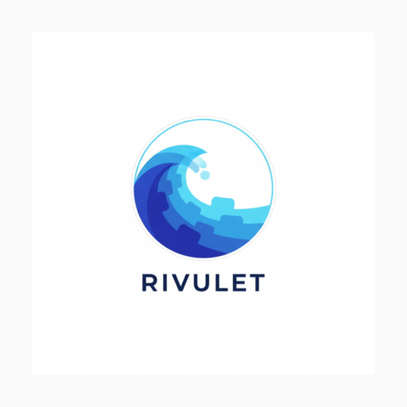

# Activity status and Discord Rich Presence

Rivulet now exposes a platform-neutral activity-status contract for a Discord-style
status message. The GUI shows the current product activity using the **Rivulet**
name. Activity labels are localized through the selected UI locale and may include
the explicitly selected game name, for example (first card line / second line):

- `Rivulet · Aufnahme` / `Elden Ring`
- `Rivulet · Streamt` / `Elden Ring`
- `Rivulet · Aufnahme + Stream` / `Elden Ring`
- `Rivulet · Pausiert` / `Elden Ring`

Discord renders `details` as the **first line**: it is composed dynamically as
**`Rivulet · <Status>`** (localized label), so the status title changes with
the activity — `Rivulet · Bereit` when idle, `Rivulet · Aufnahme` while
recording, `Rivulet · Streamt` while streaming, plus `Pausiert`, `Aufnahme +
Stream` and `Fehler`. The **second line** (`state`) carries the selected game
name whenever a game/window source is selected; without one the line is
omitted entirely (Discord rejects empty strings).

Game names must be supplied from the user's explicit source selection (the
selected game-capture window or the selected window-capture title), not inferred
from window titles or captured content. When a game-capture window is selected
its title is used as the game name; otherwise a selected window-capture title is
used, and a plain monitor source sends no game name.

The contract lives in `rivulet-core::presence` and is deliberately separate from
any Discord SDK or network client. The optional non-blocking adapter in
`rivulet-core::discord` consumes the payload and forwards it to the local
Discord desktop client over its RPC IPC socket (`discord-ipc-0`: Unix domain
socket on Linux/macOS, named pipe on Windows).

## Privacy boundary

The payload contains only the application name, a localized activity description,
and an optional user-selected game name in the state. It must not contain stream
keys, ingest URLs, local paths, window titles, usernames, or captured content.
The adapter makes the integration explicitly optional and provides a clear opt-out
in Settings (the toggle shown next to the status in the Stream view).

## Roadmap

The optional Discord Rich Presence adapter is implemented as part of **M5 –
Ecosystem & Platform Parity**. The adapter is intentionally not part of the
recording or streaming critical path. Its Definition of Done is documented in the
curated [`docs/obs-vision-roadmap.md`](obs-vision-roadmap.md): opt-out,
non-blocking lifecycle, privacy-safe payloads, graceful degradation, and tests.

## Recommended integration

The adapter (`rivulet-core::discord`) implements the recommended contract:

1. it uses the existing `PresenceStatus` payload;
2. it updates presence only on activity transitions;
3. it disconnects cleanly when Rivulet exits or the user disables the feature;
4. it never blocks capture, encoding, or the UI thread (all IPC runs on a
   dedicated worker thread; the fast path only enqueues into a channel);
5. it degrades silently to the in-app status when Discord is unavailable — the
   worker retries on the next transition without panicking or spinning.

The opt-out toggle is persisted. When disabled, no worker thread is spawned at
all and `PresenceStatus::set_activity` is a no-op.

The **Discord Developer Application client id is configurable** in Settings →
Discord Rich Presence. Rivulet **ships the official application id and the
official `rivulet_logo` artwork as defaults**, so the branded presence card
works out of the box — end users do not need to create their own Discord
application. The fields remain in Settings for custom branding: entering the
Client ID of a different Discord application (created at
<https://discord.com/developers/applications> with "Rich Presence" enabled)
overrides the default, and an **empty value restores the official default**
(installs configured before the default existed are migrated on restore).
The value is persisted across sessions; changing it (via the Apply button)
rebuilds the adapter on the next frame.

The fallback chain (`effective_client_id`/`effective_large_image_key` in
`rivulet-core::discord`) is: **configured id → official default → adapter
off**. It is also the retirement path for the application id itself: if
Discord ever forces a new id, a release bumps `DEFAULT_CLIENT_ID` (and ships
the new artwork key), documents the change in its release notes and reaches
every user through the regular updater — the release payload *is* the updater
manifest, so no separate config rollout is needed. Users with a custom id in
Settings keep it and must switch manually.

## Runbook: rotating the official application id

Use this when Discord disables the current application, the ownership of the
app must move, or a deliberate re-branding replaces the artwork. The rollout
rides entirely on the regular updater — no config migration, no manual user
steps.

### 1. Prepare the new application

1. Create/verify the new Discord application in the
   [Developer Portal](https://discord.com/developers/applications) and enable
   **Rich Presence**.
2. Upload the artwork: **Rich Presence → Art Assets** ←
   `docs/assets/rivulet-rich-presence-1024.png` as asset key `rivulet_logo`
   (or a new key, if the artwork changes too), plus **General Information →
   App Icon** ← `docs/assets/rivulet-app-icon-512.png` for the member-list
   icon.
3. Copy the new **Application ID** (17–20 digit snowflake).

### 2. Bump the code

1. In `rivulet-core/src/discord.rs` update `DEFAULT_CLIENT_ID` (and
   `DEFAULT_LARGE_IMAGE_KEY` when the asset key changes). Both constants are
   pinned by the ci_pinning guard `discord_presence_ships_official_defaults_and_migrates_empty_ids`
   — the guard fails until the test expectation is updated in the same
   commit, which is intentional: it forces a conscious change.
2. Update the constants referenced in `docs/activity-status.md`, the wiki
   pages (`Discord-Setup`, `Discord-Setup-de`) and the
   `default_config_ships_official_app_id_and_logo` / GUI
   `default_app_ships_official_discord_id_and_logo` tests.
3. Run `cargo test -p rivulet-core --lib discord && cargo test -p rivulet-gui
   --bin rivulet-gui discord && cargo test -p rivulet-core --test ci_pinning`.

### 3. Ship the release

1. Commit as `feat(presence): rotate the official Discord application id …`
   (a `feat:` commit guarantees the alpha release gate fires).
2. Paste this release-notes block and fill in the new id:

   > **Discord Rich Presence: new application id**
   > Rivulet now ships the official Discord application id `<NEW_ID>`.
   > The status/logo work exactly as before — nothing to configure. Only if
   > you entered a **custom** application id in Settings → Discord Rich
   > Presence, switch it to the new id manually (empty restores the official
   > default).

3. The updater delivers the new default with the regular update; the
   release payload *is* the updater manifest, so no separate rollout exists.

### 4. Verify after release

1. **Install the new build** (or update an existing install) and start
   Rivulet with Discord running.
2. **Log check:** `%LOCALAPPDATA%\Rivulet\logs` (Linux/macOS:
   `Rivulet/logs/`) must contain
   `Discord Rich Presence SET_ACTIVITY delivered activity=… game=…` —
   delivery proves the handshake with the new id works.
3. **Live handshake probe (no install needed):**
   `powershell -File scripts/test-discord-handshake.ps1` while Discord is
   running must return `READY` and echo the resolved asset IDs.
4. **Card check:** the Discord profile card shows the Rivulet logo and the
   status lines; the member list shows the app icon (not the game
   controller).
5. **Custom-id users:** confirm in Settings that a previously configured id
   is still present and was not overwritten by the update.

The Apply button **validates the format immediately**: a Discord client id is a
numeric snowflake of 17-20 digits. Pasting the application URL, a label
prefix, spaces, or a too-short/too-long value shows a warning („Ungültige
Client-ID"/"Invalid client ID") and the id is **not** applied, instead of
silently keeping the adapter off. Empty remains valid (adapter off by design).
This is a format check only — the id still has to belong to a real Discord
application with Rich Presence enabled for the handshake to succeed (see
`validate_client_id` in `rivulet-core::discord` and the
`discord_client_id_is_validated_on_apply` ci_pinning guard).

> **Persistence note:** persisted settings are restored in `RivuletApp::new()`
> via `eframe::get_value` from the eframe storage (the `save()` path used to
> write the app state, but nothing read it back — every restart silently
> dropped ALL configured settings). The restore re-attaches the live engine and
> the CLI `--no-frame-timeout` value; everything else (theme, locale, hotkeys,
> OBS WebSocket, MIDI presets, Discord client id, …) comes from the storage. A
> regression test (`discord_client_id_survives_eframe_storage_round_trip`)
> walks the full save → restore round trip, and a CI pinning guard keeps the
> restore wiring in `new()` locked in.

## CI smoke test

CI runs the real adapter worker (`DiscordPresence`) end to end against a local
IPC listener, verifying that a pushed status produces a **handshake frame
followed by a `SET_ACTIVITY` frame** on the wire. On Linux/macOS the listener is
an actual `discord-ipc-0`-style Unix-domain socket in a temp dir (the config
`ipc_socket_path` override points the worker at it); on Windows the worker is
run against a local **named pipe** server. The step is `Discord adapter IPC smoke
Test` in `ci.yml` (job `Build & Test on <os>-latest`).

## When is the status updated?

The presence is pushed on **activity transitions** (Ready → Recording,
Recording → Paused, …), never every frame. The per-frame reconcile call lives in
the global UI update (`ui()`), **not** inside the Stream view's draw code:
starting or stopping a recording from the Record view updates the Discord status
immediately, without having to open the Stream tab. Only activity changes cross
the IPC boundary; an unchanged status is a no-op even when the sync runs every
frame.

## Status legend in the Stream view

The Stream view renders a **legend** below the current status: one row per
state (Fehler/Error, Aufnahme+Stream, Pausiert, Aufnahme, Streamt, Bereit) with
the currently active state highlighted. Hovering any row shows a tooltip that
explains **when the state appears** and **what it means** — e.g. "Ready" is
the default on startup and after stopping, "Paused" means frames are captured
but not written. The legend is generated from `PresenceActivity::all()` (so it
never drifts from the model) and every tooltip is localized through
`tooltip_i18n_key()` in both DE/EN (enforced by the i18n parity test and the
`presence_legend_lists_every_state_with_a_tooltip` ci_pinning guard).

## State reference

All six states, their i18n labels, what triggers them, and the transitions that
leave them. The evaluation priority (newest first) is: Error → Recording + 
streaming → Paused → Recording → Streaming → Ready.

| State | DE | EN | Appears when | Transitions out |
|---|---|---|---|---|
| Bereit | `presence_ready` → „Bereit" | `presence_ready` → "Ready" | On startup and whenever neither recording nor streaming is active | → Aufnahme (recording starts) · → Streamt (streaming starts) |
| Aufnahme | `presence_recording` → „Aufnahme" | `presence_recording` → "Recording" | Recording is running and writing frames | → Pausiert (pause) · → Aufnahme+Stream (stream starts) · → Bereit (stop) · → Fehler (engine/capture failure) |
| Streamt | `presence_streaming` → „Streamt" | `presence_streaming` → "Streaming" | Streaming to the ingest server is running | → Aufnahme+Stream (recording starts) · → Bereit (stop) · → Fehler (engine failure) |
| Aufnahme + Stream | `presence_recording_streaming` → „Aufnahme + Stream" | `presence_recording_streaming` → "Recording + streaming" | Recording and streaming run at the same time | → Aufnahme (stream stops) · → Streamt (recording stops) · → Bereit (both stop) · → Fehler (failure) |
| Pausiert | `presence_paused` → „Pausiert" | `presence_paused` → "Paused" | Recording is active but paused (frames captured, not written) | → Aufnahme (resume) · → Fehler (failure) |
| Fehler | `presence_error` → „Fehler" | `presence_error` → "Error" | Engine/capture reported a failure; has priority over every activity label | → next state of the next start (recording/streaming starts clear `last_error`) · → Bereit (idle after clear) |

Only **transitions** cross the IPC boundary: an unchanged state is never
re-pushed, and "Fehler" is cleared by the next recording/streaming start —
never by the UI alone.

## The "Error" state

`PresenceActivity::Error` is produced whenever the engine or a capture thread
reported a failure (`last_error` is set — e.g. a pipeline build/start/push
error or a capture that delivered no frames). It has **priority over the
activity labels**: even while a recording or stream is nominally active, a
fresh failure surfaces as "Error"/"Fehler" instead of the activity label.

The order of evaluation is: Error → Recording + streaming → Paused → Recording
→ Streaming → Ready.

The error state stays **privacy-safe**: only the localized "Error"/"Fehler"
label is sent, never the raw error text (which may contain paths or other
implementation details). The state recovers automatically on the next start —
recording starts and both streaming-start paths clear `last_error`, so the
status moves back to the activity label rather than sticking on "Error".

## Connection diagnostics ("only Rivulet shows on Discord")

If your Discord profile shows the plain "Playing Rivulet" card **without** the
status lines you configured, that is Discord's built-in **game detection** for
the running Rivulet process — the Rich Presence `SET_ACTIVITY` frame is not
being applied (or no valid state was ever delivered). The common causes:

1. **No client ID configured** (or the feature is disabled): an empty
   Application client ID keeps the adapter fully off. Configure it in Settings
   → Discord Rich Presence.
2. **Discord desktop is not running**: the adapter connects to the local
   `discord-ipc-0` endpoint of a running Discord client. With Discord closed,
   the worker retries with exponential backoff and reports the failure to the
   crash logs (`Discord Rich Presence IPC unavailable`).
3. **The client ID belongs to the wrong application**: the ID must be the
   ``Client ID`` of a Discord application with **Rich Presence** enabled that
   has been created/toggled for Rich Presence use.

> **Known root cause (fixed):** older builds framed every IPC message with
> only a 4-byte length prefix, but Discord v1 requires the 8-byte header
> `[opcode:u32][length:u32]` (op 0 = HANDSHAKE, op 1 = FRAME). Discord
> rejected that framing with `{"code":1003,"message":"protocol error"}`
> and closed the connection — the presence never appeared although the
> client id and the `discord-ipc-0` pipe were correct. The worker now emits
> the correct header; a `ci_pinning` guard (`discord_framing_uses_the_
> opcode_length_header`) locks the framing in, and the live handshake can be
> verified against a running Discord client with
> `powershell -File scripts/test-discord-handshake.ps1` (expect a
> `DISPATCH`/`READY` reply).

Since the worker now exposes its **connection state**, the Stream view shows a
status line under the toggle that says whether the handshake was accepted
(„Verbunden"/"Connected" in the success color) or still connecting / off
(`discord_conn_off`, `discord_conn_connecting`). While the adapter is **not
connected** and a client id is configured, an **„Erneut verbinden"/"Reconnect"
button** appears right next to the status line: clicking it tears the worker
down and spawns a fresh one (new handshake) on the next frame — no app
restart needed. This covers the common case of starting Discord *after*
Rivulet, or a socket that died while Rivulet kept running. Every IPC success
or failure is also written to the daily crash logs, so the root cause is
visible instead of silently swallowing the error.

## Card artwork and the "game controller" icon

Discord renders two different things on your profile:

- **Discord's own game detection** ("Playing Rivulet" with a game-controller
  icon, no status lines below) is Discord's built-in detection of the running
  `rivulet-gui.exe` process. It is not part of Rivulet's Rich Presence and
  cannot be removed over the IPC protocol. To hide it, remove Rivulet from
  Discord → Settings → Activity Status → **Registered Games** (✕ next to the
  entry), or disable game detection entirely.
- **The Rich Presence card** ("Rivulet" title + status line below) is ours.
  It always shows the application name as the title — exactly like OBS shows
  "OBS Studio" — but the **placeholder game-controller icon** can be replaced
  with real artwork: upload an image under **Rich Presence → Art Assets** in
  the Discord Developer Portal for your application, then enter its asset
  name in Settings → Discord Rich Presence → **Art asset key (optional)**
  (e.g. `rivulet_logo`) and click Apply. Discord then renders the artwork
  instead of the generic icon, OBS-style.

## Uploading the Rivulet logo as an Art Asset

The repository ships a ready-to-upload artwork:

| File | Size | Use |
|------|------|-----|
| `docs/assets/rivulet-rich-presence-1024.png` | 1024×1024 PNG | **Upload this one** to Rich Presence → Art Assets |
| `docs/assets/rivulet-rich-presence-512.png` | 512×512 PNG | Documentation preview |
| `docs/assets/rivulet-app-icon-512.png` | 512×512 PNG | **Upload this one** as the **App Icon** (General Information) — replaces the game-controller icon in the server member list |
| `rivulet-gui/assets/rivulet_logo.jpg` | 1024×1024 JPG | Source logo |

**Discord's requirements and best practices:**

- **Size:** exactly **1024×1024** pixels (Discord's recommended art-asset
  size; smaller images are scaled up and look soft).
- **Format:** **PNG** (preferred) or JPG. PNG avoids the compression artifacts
  that show up on the profile card.
- **File size:** keep it under Discord's 5 MB upload limit — the shipped
  PNG is ~130 KB.
- **Padding:** the artwork is displayed inside a card with rounded corners
  and slight zoom, so the motif must not touch the image edges. The shipped
  asset keeps ~8 % padding around the logo.
- **Square:** the card is square; a non-square image gets cropped.

**Step-by-step upload (once, by the app owner):**

1. Go to
   `https://discord.com/developers/applications/1544027006847680532/rich-presence`.
2. In the **Rich Presence** section, open the **Art Assets** tab.
3. Click **Upload Image**, select `docs/assets/rivulet-rich-presence-1024.png`.
4. Discord asks for an **asset name** — enter exactly `rivulet_logo` (this
   is the key referenced by the client; spaces are replaced by `_`).
5. Click **Save**. The asset now appears in the list with the key
   `rivulet_logo`.

**Wire it up in Rivulet:**

1. Settings → Discord Rich Presence → **Art asset key (optional)**.
2. Enter `rivulet_logo` and click **Apply**.
3. The next `SET_ACTIVITY` carries `assets.large_image = "rivulet_logo"`;
   Discord renders the artwork instead of the generic placeholder icon.
   (Verified live: the handshake accepts the activity with the asset key.)

If you upload the artwork under a different asset name, use that exact name
as the key in Settings — the two must match character-for-character.

The two card lines follow Discord's rendering order: `details` is the
**first line** and always carries the composed title
**`Rivulet · <Status>`** (app word + localized label, e.g.
"Rivulet · Recording"/"Rivulet · Aufnahme") so small hover cards that do
not render the registration title still identify Rivulet; `state` is the
**second line** and carries the selected game name when a game/window
source is selected, and is omitted entirely when no game is selected. The
literal app title row on the full profile card (application icon + name)
still comes from the Discord application registration and cannot be
changed per status via the API.

The configured art asset key is attached twice: as `large_image` (rendered
as the big artwork on the profile card) and mirrored as `small_image`
(rendered as the small icon in the **member list**, replacing the generic
game-controller placeholder there). Both reference the same uploaded asset,
so no second upload is needed; the mirroring is covered by the wire-contract
test and pinned by `ci_pinning.rs`.

> **Platform limit — what the member list can show (by Discord's design):**
> the compact member-list row renders **only** the application icon and the
> text "Spielt/Rivulet" — the app name from the Discord registration.
> The payload lines (`details` = status label, `state` = game name) are
> rendered **exclusively** in the detail view (profile card / hover), never
> in the member list — no API field changes this. To replace the game-
> controller icon there, upload an **App Icon** in the Developer Portal
> (General Information → App Icon, 512×512 PNG —
> `docs/assets/rivulet-app-icon-512.png`); the Rich-Presence art asset
> alone does not affect the member-list icon. The app-icon file is a
> punchier small-avatar variant (wave symbol only, dark brand gradient,
> no padding) so it stays readable at the tiny round avatar size.

> **Empty `state` is rejected by Discord (fixed):** Discord refuses a
> `SET_ACTIVITY` that contains an empty string with
> `4000: "..." is not allowed to be empty` (verified live against a
> running client, originally for the `details` field). Rivulet therefore
> **omits `state` entirely** when no game name is selected instead of sending
> an empty string — the card then shows only the status line. A `ci_pinning`
> guard (`empty_state_is_omitted_not_sent_empty`) locks this in.

### Payload validation contract (CI-enforced)

Discord's Rich Presence validation rules are enforced by a dedicated CI
check (`Discord payload contract check` in `.github/workflows/ci.yml`), so a
`4000` rejection can never reach a live client unnoticed again. The contract
lives in `rivulet-core/src/discord.rs`:

| Rule | Behavior | Enforced by |
|---|---|---|
| `details` always non-empty | `details` is the first card line and always carries the status label — never sent empty | Wire contract test over every payload variant |
| `state` must never be empty | Empty `state` is **omitted** entirely, never sent as `""` (Discord rejects empty strings with `4000`) | Wire contract test over every payload variant |
| `state`/`details` ≤ 128 characters | Overlong values are truncated at a UTF-8 boundary; the validator flags the pre-truncation condition so Settings can warn | `truncate()` + `validate_set_activity_payload` |
| `large_image` key format | Only plausible keys (`[A-Za-z0-9_]`, ≤ 64 chars) are attached; empty or malformed keys are filtered before send — Discord would otherwise silently drop the image | Serializer filter + `PayloadIssue::InvalidAssetKey` |

`pub fn validate_set_activity_payload(status, large_image_key)` returns every
`PayloadIssue` (`FieldTooLong`, `InvalidAssetKey`) for a status before it is
put on the wire. The exhaustive test
`every_payload_variant_conforms_to_discord_rules_on_the_wire` serializes all
combinations (6 activities × 2 locales × game/no-game/long-game ×
asset/no-asset/bad-asset) and asserts the actual JSON sent to Discord
satisfies all three rules — a regression in the serializer fails CI locally
instead of producing a silent `4000` on a live client.

The same validator is wired into **Settings**: clicking **Apply** (client id
or art asset key) runs `validate_set_activity_payload` against the current
status and the configured key, and any violation is shown immediately in red
next to the Discord section (`discord_payload_error_field_too_long`,
`discord_payload_error_asset_key`, DE/EN). An empty art-asset key is treated
exactly like no key (placeholder icon) and never triggers the warning.

## Verifying Rich Presence is enabled for the application

Rich Presence must be **enabled on the Discord application itself**, not just
configured in Rivulet. There are two complementary checks:

1. **Developer Portal (authoritative, requires the app owner to be logged
   in):** open
   `https://discord.com/developers/applications/<client-id>/rich-presence`
   (for the configured Rivulet app: `1544027006847680532` →
   `https://discord.com/developers/applications/1544027006847680532/rich-presence`).
   The **Rich Presence** page in the left-hand sidebar shows the feature
   status and the **Art Assets** tab where images (e.g. `rivulet_logo`) are
   uploaded. If the app has never been opened there, or the side menu shows no
   Rich Presence entry, the feature is not enabled for that application.
2. **Live IPC handshake (no portal login needed, proves acceptance):** run
   `powershell -File scripts/test-discord-handshake.ps1` while Discord desktop
   is running. A successful check prints `READY` (with the logged-in user) and
   then the `SET_ACTIVITY` frame **without any error reply**. Discord rejects
   `SET_ACTIVITY` with an error frame (e.g. `40001` / `DISALLOWED`) when the
   application does not have Rich Presence enabled — so a clean exchange
   confirms the feature is active for the configured client id.

   The handshake reply also reveals whether an art asset key is usable: the
   echoed `assets` object contains only the keys Discord accepted. When the
   `large_image` key is missing from the reply (only `large_text` echoes),
   the asset has not been uploaded yet — Discord silently drops image keys
   that do not exist in the application. Once uploaded, Discord resolves the
   key to a **numeric asset id** in the reply (e.g.
   `"large_image":"1544569244803538964"` for `rivulet_logo`).

   The public CDN URL is served under that numeric asset id, **not** the key
   name — `curl -I https://cdn.discordapp.com/app-assets/<client-id>/<asset-id>.png`
   returns `200` for an uploaded asset, while the
   `.../app-assets/<client-id>/<asset-name>.png` form always returns `404`
   (for the Rivulet app the checked key is `rivulet_logo`, resolved asset id
   `1544569244803538964`). If only the key name is known, the live handshake
   reply is the reliable way to obtain the id.

> **Why the public API is not the check:** `GET
> https://discord.com/api/v10/applications/<id>` returns `401 Unauthorized`
> without an OAuth2/bot token, and the Rich Presence flag is not part of the
> unauthenticated application payload anyway. The IPC handshake above is the
> practical verification for a locally-running client.

For the Rivulet application `1544027006847680532` the live handshake against
the local Discord client succeeds: `READY` is returned and the `SET_ACTIVITY`
frame is accepted without an error reply, which confirms Rich Presence is
enabled on that application.
